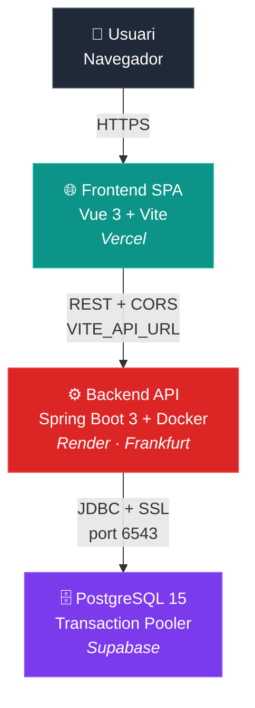

# 📚 Library Manager — Desplegament Fullstack

Aplicació de gestió de llibres desplegada en arquitectura de 3 capes al núvol.

- **🌐 URL pública Frontend:** https://library-manager.vercel.app
- **🔧 URL pública API:** https://library-api.onrender.com/api/books
- **📦 Repositori Backend:** https://github.com/USUARI/library-backend
- **📦 Repositori Frontend:** https://github.com/USUARI/library-frontend

> Substituir per les URLs reals de l'entrega.

---

## 📐 Arquitectura



### Stack escollit

| Capa | Servei | Pla | Justificació |
|---|---|---|---|
| **Frontend** | Vercel | Free | Detecció automàtica de Vite, SSL inclòs, deploy a partir de push |
| **Backend** | Render | Free | Suport natiu de Docker, integració amb GitHub, regió a Frankfurt |
| **Database** | Supabase | Free | PostgreSQL 500 MB, pooler IPv4, SQL editor integrat |

---

## 🛠️ Configuració de variables d'entorn

### Backend (Render → Environment)

| Variable | Descripció | Valor d'exemple |
|---|---|---|
| `SPRING_DATASOURCE_URL` | JDBC URL del pooler Supabase | `jdbc:postgresql://aws-0-eu-west-1.pooler.supabase.com:6543/postgres?sslmode=require` |
| `SPRING_DATASOURCE_USERNAME` | Usuari del pooler | `postgres.xxxxxxxxxxxxx` |
| `SPRING_DATASOURCE_PASSWORD` | Contrasenya de Supabase | `••••••••` |
| `APP_CORS_ALLOWED_ORIGINS` | URL EXACTA del frontend | `https://library-manager.vercel.app` |
| `PORT` | Port de Render | `8080` |

> ⚠️ Usar el **Transaction Pooler de Supabase (port 6543)**, no la direct connection (5432). Render Free no té IPv6.

### Frontend (Vercel → Environment Variables)

| Variable | Valor |
|---|---|
| `VITE_API_URL` | `https://library-api.onrender.com/api` |

> Aplica-la a **Production, Preview i Development**. Després de canviar-la, fer **redeploy**.

---

## 🚀 Pas a pas del desplegament per a un nou desplegament

### 1) Crear projecte a Supabase
1. Anar a [supabase.com](https://supabase.com) → New project
2. Apuntar el password generat (no es pot recuperar)
3. Project Settings → Database → Connection string → **Transaction pooler**

### 2) Crear taula al SQL Editor de Supabase
```sql
CREATE TABLE IF NOT EXISTS books (
    id BIGSERIAL PRIMARY KEY,
    title VARCHAR(255) NOT NULL,
    author VARCHAR(255) NOT NULL,
    isbn VARCHAR(20) UNIQUE,
    published_year INTEGER,
    genre VARCHAR(100),
    description TEXT,
    available BOOLEAN DEFAULT TRUE,
    created_at TIMESTAMP DEFAULT NOW()
);
```

### 3) Desplegar backend a Render
1. Pujar codi del backend a GitHub (amb Dockerfile a l'arrel)
2. Render → New Web Service → connectar repo → **Runtime: Docker**
3. Region: **Frankfurt**, Plan: **Free**
4. Afegir les 5 variables d'entorn (taula de dalt)
5. Deploy → esperar logs `Started LibraryApplication in X.XXX seconds`

### 4) Desplegar frontend a Vercel
1. Pujar codi del frontend a GitHub
2. Vercel → Add New Project → Import → **Framework: Vite**
3. Afegir `VITE_API_URL` apuntant a Render
4. Deploy

### 5) Actualitzar CORS al backend
Un cop tens la URL de Vercel, edita la env var `APP_CORS_ALLOWED_ORIGINS` a Render i fes redeploy.

---

## 📁 Estructura dels repositoris

### Backend
```
library-backend/
├── src/main/java/com/example/library/
│   ├── LibraryApplication.java
│   ├── model/Book.java
│   ├── repository/BookRepository.java
│   ├── controller/BookController.java
│   └── config/CorsConfig.java         ← CORS amb @Value llegint env var
├── src/main/resources/
│   └── application.yml                 ← Tot amb ${VAR:default}
├── Dockerfile                          ← Multi-stage build, Java 17 Alpine
├── .dockerignore
├── pom.xml
└── .gitignore
```

### Frontend
```
library-frontend/
├── src/
│   ├── views/
│   │   ├── BooksListView.vue
│   │   ├── BookDetailView.vue
│   │   └── CreateBookView.vue
│   ├── services/api.js                 ← Axios + interceptor neteja errors
│   ├── stores/books.js                 ← Pinia store amb validació
│   ├── router/index.js
│   └── App.vue
├── vercel.json                         ← Rewrites SPA per evitar 404
├── .env.example
└── package.json
```

---

## 🔴 Errors trobats i resolució

### Error 1 — Backend no arrenca: `Failed to configure a DataSource`

**Símptoma a Render:**
```
APPLICATION FAILED TO START
Reason: Failed to determine a suitable driver class
```

**Causa:** L'`application.properties` original tenia hardcoded `jdbc:postgresql://localhost:5432/...`. Quan es desplega, no s'expandeix amb env vars.

**Solució:** Reescriure `application.yml` amb placeholders i defaults:
```yaml
spring:
  datasource:
    url: ${SPRING_DATASOURCE_URL:jdbc:postgresql://localhost:5432/librarydb}
    username: ${SPRING_DATASOURCE_USERNAME:postgres}
    password: ${SPRING_DATASOURCE_PASSWORD:postgres}
```

---

### Error 2 — `Connection refused` o `Network is unreachable` cap a Supabase

**Símptoma:**
```
HikariPool-1 - Failed to validate connection
java.net.SocketException: Network is unreachable: connect
```

**Causa:** Render Free no té IPv6, però la direct connection de Supabase (port `5432`) només dona IPv6 al pla gratuït.

**Solució:** Canviar el connection string per usar el **Transaction Pooler de Supabase** (port `6543`), que sí ofereix IPv4:
```
jdbc:postgresql://aws-0-eu-west-1.pooler.supabase.com:6543/postgres?sslmode=require
```

I que el username sigui `postgres.PROJECTID` (no només `postgres`).

---

### Error 3 — `Could not resolve placeholder 'app.cors.allowed-origins'`

**Símptoma:**
```
PlaceholderResolutionException: Could not resolve placeholder 'app.cors.allowed-origins'
```

**Causa:** Spring Boot només converteix automàticament env vars a propietats si el nom segueix la convenció. La env var `CORS_ALLOWED_ORIGINS` no es mapeja a `app.cors.allowed-origins`.

**Solució (combinada):**
1. Renombrar la env var a Render: `APP_CORS_ALLOWED_ORIGINS` (amb prefix `APP_`)
2. Afegir un default al `@Value` per a desenvolupament local:
   ```java
   @Value("${app.cors.allowed-origins:http://localhost:5173}")
   private String allowedOrigins;
   ```

---

### Error 4 — `CORS policy: No 'Access-Control-Allow-Origin'` al navegador

**Símptoma a la consola del navegador:**
```
Access to XMLHttpRequest at 'https://library-api.onrender.com/api/books'
from origin 'https://library-manager.vercel.app' has been blocked by CORS policy
```

**Causa:** El backend tenia configurat `http://localhost:5173` com a allowed origin, no la URL real de Vercel.

**Solució:** Substituir tot ús de `@CrossOrigin("*")` per una `CorsConfig` global amb allowlist específica que llegeix d'env var:
```java
config.setAllowedOrigins(Arrays.asList(allowedOrigins.split(",")));
config.setAllowCredentials(true);
```
I actualitzar `APP_CORS_ALLOWED_ORIGINS=https://library-manager.vercel.app` a Render.

---

### Error 5 — Frontend dóna 404 en refrescar `/books/3`

**Símptoma:** Entrar directament a `/books/3` o refrescar qualsevol pàgina que no sigui `/` retorna 404.

**Causa:** Vercel serveix arxius estàtics i busca `/books/3.html`, que no existeix. Vue Router gestiona les rutes client-side, no hi ha cap fitxer físic.

**Solució:** Crear `vercel.json` amb rewrite cap a `/index.html`:
```json
{
  "rewrites": [{ "source": "/(.*)", "destination": "/" }]
}
```

---

### Error 6 — La URL d'API queda hardcoded en el build de producció

**Símptoma:** Després del deploy a Vercel, les peticions van a `http://localhost:8080` (error de Mixed Content).

**Causa:** Els components Vue tenien `axios.get('http://localhost:8080/...')` directament.

**Solució:** Crear `src/services/api.js` que usa `import.meta.env.VITE_API_URL`, i definir aquesta variable a `.env` local i al panell de Vercel. Tots els components usen `booksApi` i no saben mai la URL real.

---

### Error 7 — Pinia es contamina amb objectes d'error de Spring

**Símptoma:** A la llista de llibres hi apareixen "llibres" amb propietats `timestamp`, `status: 500`, `error: "Internal Server Error"`. Persisteixen entre sessions si hi ha localStorage.

**Causa:** Spring retorna `{ timestamp, status, error, message, path }` en errors 5xx. El store assignava `response.data` directament a `books`.

**Solució en dos passos:**
1. Interceptor d'Axios que transforma errors a forma neta:
   ```js
   apiClient.interceptors.response.use(
     (response) => response,
     (error) => Promise.reject({ message: extractMessage(error), ... })
   )
   ```
2. Validació estricta al store que només accepta arrays vàlids:
   ```js
   books.value = Array.isArray(data) ? data : []
   ```

---

### Error 8 (extra) — Hibernate no crea les taules a Supabase

**Símptoma:** Petició POST falla amb `ERROR: relation "books" does not exist`.

**Causa:** El Transaction Pooler de Supabase té limitacions per a operacions DDL (CREATE TABLE). `ddl-auto: update` pot fallar silenciosament.

**Solució:** Crear les taules manualment via SQL Editor de Supabase abans de fer la primera petició (vegeu pas 2 del desplegament).

---

## ✅ Checklist de l'entrega

- [x] Backend amb env vars (no hardcoded)
- [x] CORS amb allowlist específica (no `*`)
- [x] Logs d'arrencada sense errors de DB
- [x] Frontend amb `.env` local + env var al panell Vercel
- [x] `vercel.json` amb SPA rewrites
- [x] Saneig d'errors d'API amb interceptor d'Axios
- [x] URL pública del frontend al README
- [x] Esquema d'arquitectura (Mermaid)
- [x] Documentació de 8 errors reals i solucions

---

## 💻 Execució en local

### Backend
```bash
# Postgres local corrent al port 5432 amb BD 'librarydb'
cd backend
./mvnw spring-boot:run
# API a http://localhost:8080/api/books
```

### Frontend
```bash
cd frontend
npm install
cp .env.example .env
npm run dev
# Web a http://localhost:5173
```
